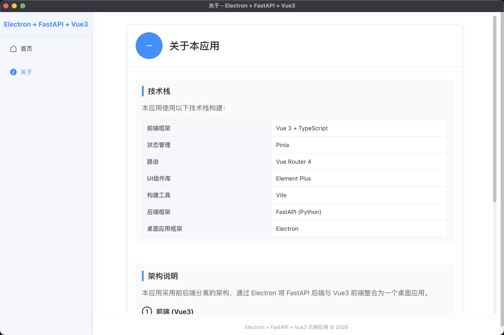
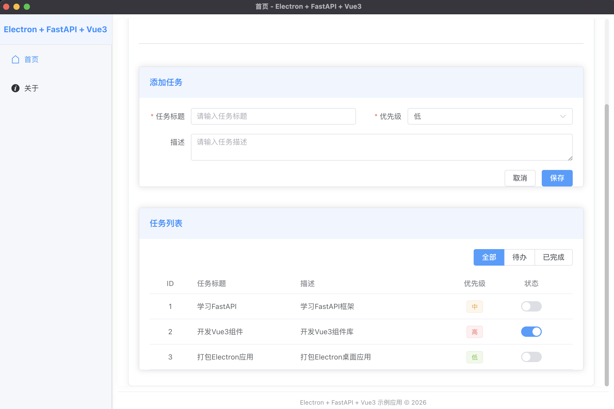

# 🚀 Electron + FastAPI + Vue3 桌面应用

FastClient 是一个现代化的桌面应用，结合了Electron、FastAPI和Vue3的强大功能。应用采用PyInstaller打包方案，实现完全独立的可执行文件，无需用户安装Python环境。

## ✨ 特性

- 🖥️ **跨平台桌面应用**：基于Electron构建，支持Windows、macOS和Linux
- ⚡ **现代前端技术栈**：Vue3 + TypeScript + Pinia + Element Plus
- 🐍 **高性能后端API**：FastAPI + Python
- 📦 **独立打包**：使用PyInstaller，无需Python环境依赖
- 🔄 **自动刷新开发**：集成electron-reloader，支持开发模式自动刷新
- 🛡️ **类型安全**：全面的TypeScript支持
- 🔒 **安全启动机制**：后端只能通过前端启动，防止独立执行
- 📋 **完整菜单系统**：包含顶部菜单和右键上下文菜单
- ⌨️ **快捷键支持**：所有操作都绑定了快捷键
- 🎨 **现代化UI**：基于Element Plus的精美界面
- 📊 **任务管理系统**：完整的CRUD功能，支持任务状态切换和筛选

## 📁 项目结构

```
FastClient/
├── backend/                    # FastAPI后端
│   ├── app/
│   │   └── main.py            # FastAPI应用入口
│   ├── dist/                  # PyInstaller打包输出
│   │   └── fastapi-backend     # 独立后端可执行文件（根据平台自动添加后缀）
│   ├── pyproject.toml         # Python依赖管理
│   ├── uv.lock               # 依赖锁定文件
│   └── fastapi-backend.spec   # PyInstaller打包配置
├── frontend/                  # Electron + Vue3前端
│   ├── public/               # 静态资源
│   │   └── icon.svg         # 应用图标
│   ├── resources/           # 资源文件
│   │   ├── fastapi-backend  # 后端可执行文件（Linux/macOS）
│   │   └── fastapi-backend.exe # 后端可执行文件（Windows）
│   ├── src/                  # Vue3应用源码
│   │   ├── api/             # API接口
│   │   ├── router/          # 路由配置
│   │   ├── store/           # Pinia状态管理
│   │   ├── views/           # 页面视图
│   │   ├── App.vue          # 根组件
│   │   ├── env.d.ts         # 环境类型声明
│   │   └── main.ts          # 应用入口
│   ├── electron/            # Electron主进程代码
│   │   ├── main.js          # 主进程入口
│   │   └── preload.js       # 预加载脚本
│   ├── .gitignore           # Git忽略文件
│   ├── index.html           # HTML模板
│   ├── package.json         # 前端依赖配置 + electron-builder配置
│   ├── pnpm-lock.yaml       # pnpm依赖锁定文件
│   ├── tsconfig.json        # TypeScript配置
│   └── vite.config.ts       # Vite配置
└── README.md               # 项目说明
```

## 🛠️ 技术栈

### 前端技术
- **Electron** - 跨平台桌面应用框架
- **Vue 3** - 渐进式JavaScript框架
- **TypeScript** - 类型安全的JavaScript超集
- **Pinia** - Vue状态管理库
- **Element Plus** - 基于Vue 3的企业级UI组件库
- **Vite** - 快速构建工具

> **UI组件库说明**：项目最初采用Arco Design，但在开发过程中发现存在较多bug和兼容性问题，因此替换为更稳定、功能更完善的Element Plus组件库。Element Plus提供了更丰富的组件和更好的TypeScript支持，大大提升了开发效率和用户体验。

### 后端技术
- **FastAPI** - 现代高性能Web框架
- **Python 3.10+** - 编程语言
- **Uvicorn** - ASGI服务器
- **PyInstaller** - Python应用打包工具

### 开发工具
- **uv** - 快速Python包管理器
- **electron-builder** - Electron应用打包工具

## 📋 环境要求

### 开发环境
- **Node.js** 16.0+
- **Python** 3.10+
- **uv** (推荐) 或 pip
- **pnpm** (推荐) 或 npm 或 yarn

### 运行环境
- **Windows** 10/11
- **macOS** 11.0+
- **Linux** Ubuntu 20.04+, CentOS 7+, Debian 10+

## 🚀 快速开始

### 1. 克隆项目

```bash
git clone <repository-url>
cd FastClient
```

### 2. 安装后端依赖

```bash
cd backend
# 使用uv (推荐)
uv sync

# 或使用pip
pip install -e .
```

### 3. 安装前端依赖

```bash
cd ../frontend
# 使用pnpm (推荐)
pnpm install

# 或使用npm
npm install

# 或使用yarn
yarn install
```

### 4. 开发模式启动

#### 方式：一键启动（推荐）
```bash
# 直接启动Electron开发模式（自动启动后端）
cd frontend
npm run electron:dev
```



```


#### 🔧 开发模式说明
- **后端端口**：`http://localhost:8001`（开发模式）
- **前端端口**：`http://localhost:5174`（Vite开发服务器）
- **自动启动**：`npm run electron:dev` 会自动启动后端Python脚本
- **热重载**：前端代码修改会自动刷新，后端修改需重启

## 📦 生产环境打包

### 完整打包流程

```bash
# 1. 打包后端为独立可执行文件
cd backend
uv run pyinstaller --onefile --name fastapi-backend app/main.py

# 2. 复制后端可执行文件到前端资源目录
# 注意：PyInstaller会根据平台自动添加后缀（.exe on Windows, no suffix on macOS/Linux）
cp dist/fastapi-backend* ../frontend/resources/

# 3. 构建前端
cd ../frontend
npm run build

# 4. 打包Electron应用
# electron-builder配置位于package.json的build字段中
npm run electron:build
```

### 输出文件
- **Windows**：
  - 安装包：`frontend/release/MyElectronApp Setup 1.0.0.exe`
  - 便携版：`frontend/release/win-unpacked/MyElectronApp.exe`
- **macOS**：
  - 安装包：`frontend/release/MyElectronApp-1.0.0-arm64-mac.zip`（或类似名称）
  - 应用程序：`frontend/release/mac-arm64/MyElectronApp.app`
- **Linux**：
  - AppImage：`frontend/release/MyElectronApp-1.0.0-arm64.AppImage`（或类似名称）

## 🔧 开发指南

### 添加Python依赖

```bash
cd backend
# 添加新依赖
uv add package-name

# 重新打包后端
uv run pyinstaller --onefile --name fastapi-backend app/main.py

# 复制到前端并重新打包
# 注意：PyInstaller会根据平台自动添加后缀（.exe on Windows, no suffix on macOS/Linux）
cp dist/fastapi-backend* ../frontend/resources/
cd ../frontend
npm run build
npm run electron:build
```

### 添加前端依赖

```bash
cd frontend
npm install package-name
```

### API开发

后端API在 `backend/app/main.py` 中定义：

```python
from fastapi import FastAPI

app = FastAPI()

@app.get("/api/example")
async def example_endpoint():
    return {"message": "Hello from FastAPI!"}
```

### 前端API调用

项目使用Axios进行API调用，在 `frontend/src/api/api.ts` 中定义了统一的API客户端：

```typescript
// api/api.ts
import axios from 'axios'

export const apiClient = axios.create({
  baseURL: isElectron ? 'http://localhost:8001' : '/api',
  timeout: 10000
})

// 定义任务类型
export interface Task {
  id?: number
  title: string
  description: string
  priority: number
  completed: boolean
}

// 示例API调用
export const getTasks = async () => {
  const response = await apiClient.get<Task[]>('/tasks')
  return response.data
}
```

**注意**：项目已配置API代理，开发模式下自动代理到http://localhost:8001，生产模式下直接访问http://localhost:8001。

### 安全考虑

- 前端和后端之间通过localhost通信，减少了网络安全风险
- 后端默认监听0.0.0.0:8001，在生产环境中可以考虑限制为127.0.0.1
- 建议在生产环境中添加适当的安全验证机制
- 后续版本计划实现token验证机制，确保后端只能通过前端启动

## 🐛 常见问题

### Q: 开发模式启动时出现端口冲突？
A: 项目已配置开发模式使用8001端口，生产模式使用8000端口。如仍有冲突，可在 `backend/app/main.py` 中修改端口配置。

### Q: 开发模式下前后端无法通信？
A: 确保：
1. 后端正常启动在8001端口
2. 前端API配置正确（`frontend/src/api/api.ts`）
3. 使用相对路径调用API，项目已配置自动代理

### Q: UI组件显示异常？
A: 可能是由于从Arco Design迁移到Element Plus过程中的组件替换不完全。请检查组件名称、属性和样式是否正确更新。

### Q: 打包后的应用无法启动后端？
A: 确保 `fastapi-backend` 相关文件已正确复制到 `frontend/resources/` 目录，并重新打包应用。注意：不同平台的可执行文件名称不同（Windows上为 `.exe`，macOS/Linux上无后缀）。

### Q: 如何修改应用图标？
A: 将图标文件放在 `frontend/public/` 目录，并在 `electron-builder.json` 或 `package.json` 的 `build` 配置中指定图标路径。

### Q: 如何支持其他平台？
A: 需要在对应平台上重新打包：
1. 在目标平台上克隆项目并安装依赖
2. 打包后端可执行文件（PyInstaller会自动适配平台）
3. 构建前端并打包Electron应用

应用的主进程代码 `main.js` 已包含平台检测逻辑，会根据不同平台选择正确的后端可执行文件和Python路径。

## 📄 许可证

MIT License - 详见 [LICENSE](LICENSE) 文件

## 🤝 贡献

欢迎提交 Issue 和 Pull Request！

## 📞 联系

如有问题，请提交 Issue 或联系项目维护者。

## 🎨 社区交流

| 群组二维码 | 微信支付二维码 |
| --- | --- |
|  |  |